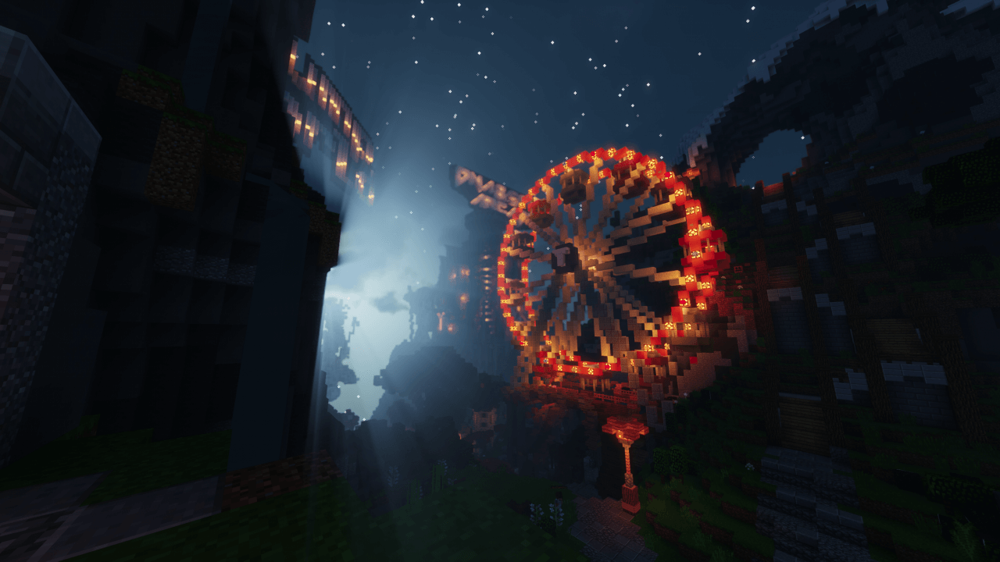

# Server Media Files

This repository holds media related to game servers.

## Example usages


Icon for [Discord Rich Presence](https://docs.labymod.net/pages/server/discord_rich_presence/)


[LabyMod Dashboard](https://www.labymod.net/dashboard) Stats

## Filestructure

- `minecraft_servers`: Contains images for Minecraft servers.

For every server a folder has to be created. The directory name should be lowercase and not contain any special characters.

To be accepted a server should be already released and on more than ~20 concurrent players on a daily basis.

A folder can contain seven files (*required):

- `icon.png`*: An icon, mostly the favicon or the Minecraft server icon. (256 x 256)
- `logo.png`: The logo of the server. Mostly a more detailed image. (128-256 x 256-512)
- `background.png`: Mostly a screenshot of the lobby of the server. Should look good when overlaid with the `logo.png`. [example background.png](#example-backgroundpng) (1280 x 720)
- `icon@2x.png`*: hDPI version of `icon.png` (512 x 512)
- `logo@2x.png`: hDPI version of `logo.png` (256-512 x 512-1024)
- `background@2x.png`: hDPI version of `background.png` (1920 x 1080)
- `manifest.json`*: Information for minecraft server. See [example manifest.json](#example-manifestjson)

## Image specification

All images must have the following requirements:

- Filetype must be PNG.
- They should be compressed and optimized.
- Images with transparency are preferred.
- If multiple images are available, the ones optimized for a white background are preferred.
- The image should be trimmed, so it contains the minimum amount of empty space on the edges.

### Icon image requirements

Additional to the general image requirements listed above, for the icon image,
the following requirements are applied as well:

- Aspect ratio needs to be 1:1 (square).
- Icon size must be 256x256 pixels, for the hDPI this is 512x512 pixels.
- The maximum icon pixel size is, of course, preferred.

### Logo image requirements

Additional to the general image requirements listed, for the logo image,
the following requirements are applied as well:

- A landscape image is preferred.
- Aspect ratio should respect the logo of the brand.
- The shortest side of the image must be at least 128 pixels, 256 pixels for the hDPI version.
- The shortest side of the image must be no bigger than 256 pixels, 512 pixels for the hDPI version.
- The maximum pixel size for the shortest side of the images is, of course, preferred.

### Example manifest.json

```json
{
  "server_name": "timolia",
  "nice_name": "Timolia",
  "direct_ip": "play.timolia.de",
  "server_wildcards": [
    "%.timolia.de"
  ],
  "social": {
    "web": "https://timolia.de/",
    "twitter": "TimoliaTeam",
    "discord": "https://discord.com/invite/Q55FujN"
  }
}
```

Required values are: `server_name`, `nice_name` & `direct_ip`

### Example background.png



## Trademark Legal Notices

All product names, trademarks and registered trademarks in the images in this
repository, are property of their respective owners. All images in this
repository are used for identification purposes only.

The use of these names, trademarks and brands appearing in these image files,
do not imply endorsement.

---

*Project inspired by [home-assistant/brands](https://github.com/home-assistant/brands)*
